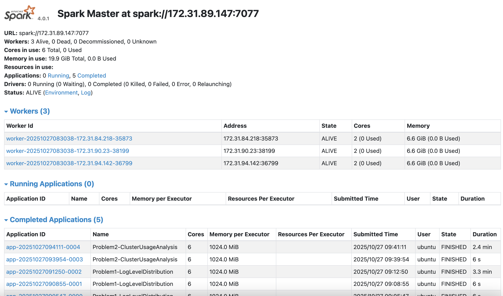

# Spark Log Analysis Report

## 1. Approach

### Problem 1 — Log Level Analysis
**Goal:** To process millions of raw log lines and identify how many belong to each log level (INFO, WARN, ERROR, DEBUG), producing summary statistics and representative samples for inspection.

By combining Spark’s distributed processing with regex-based parsing, this method efficiently handles tens of millions of records while preserving accuracy and scalability.
The intermediate caching and filtering minimized shuffle overhead and improved runtime.

**Steps:**
1. Loaded raw log data into PySpark.
2. Used regular expressions to extract log levels and messages.
3. Filtered valid log entries and grouped by `log_level` to compute counts.
4. Saved:
   - `problem1_counts.csv` — log level counts  
   - `problem1_sample.csv` — random log samples  
   - `problem1_summary.txt` — overview summary  

**Output Highlights:**
| Log Level | Count | Percentage |
|------------|--------|------------|
| INFO | 27,389,482 | 99.92% |
| WARN | 9,595 | 0.04% |
| ERROR | 11,259 | 0.04% |
| DEBUG | 0 | 0.00% |

---

### Problem 2 — Cluster Usage and Duration Analysis
**Goal:** Cluster Spark applications based on runtime duration to identify workload patterns.

**Steps:**
1. Parsed application metadata including start and end times.
2. Computed `duration_seconds` for each app.
3. Applied KMeans clustering to group applications by runtime.
4. Generated:
   - `problem2_timeline.csv` — app start/end/duration  
   - `problem2_cluster_summary.csv` — cluster-level stats  
   - `problem2_stats.txt` — global summary  
   - `problem2_bar_chart.png` — apps per cluster  
   - `problem2_density_plot.png` — duration distribution  

---

## 2. Key Findings and Insights

### Problem 1
- Most lines lack a formal log level.
You processed 33,236,604 log lines in total; only 27,410,336 lines (≈ 82.47%) include an extractable level, leaving 5,826,268 lines (≈ 17.53%) without a recognizable level token. This is a sizable blind spot when building alerting or SLOs from logs.

- INFO dominates; actionable events are rare.
Of the lines with a level, INFO = 27,389,482 (≈ 99.92%), WARN = 9,595 (≈ 0.035%), ERROR = 11,259 (≈ 0.041%), DEBUG = 0.
In other words, WARN + ERROR ≈ 0.076% of leveled lines. This is good from a reliability standpoint, but it also means signal is deeply buried inside noise.

- No DEBUG logs at all.
Either DEBUG logging was disabled in production or removed upstream. That’s positive for performance/log volume, but it reduces diagnostic depth when incidents happen. Consider conditional/targeted DEBUG (e.g., sampling or toggled flags) to keep costs low while retaining “deep dive” capability.

- Operational implications.

    - The extreme INFO skew suggests alerting should not rely on absolute counts—use rates/percentiles (e.g., WARN/ERROR per minute per service) and change-point detection.

    - The 17.5% un-leveled bucket likely hides useful information. Standardizing the log format (consistent timestamp + level prefix) would improve monitoring accuracy and downstream analytics.

    - Given how tiny WARN/ERROR are, you can aggressively filter/store only these levels in a “hot” analytics tier and push bulk INFO to cheaper storage.

### Problem 2
- Usage is extremely concentrated on a single cluster. You found 6 unique clusters and 194 applications overall. Cluster 1485248649253 accounts for 181 apps (≈ 93%). The rest are minor:

    - 1472621869829 → 8 apps

    - 1448006111297 → 2 apps

    - 1440487435730 → 1 app

    - 1460011102909 → 1 app

    - 1474351042505 → 1 app

This is a strong signal that capacity planning, hardening, and monitoring should prioritize the big cluster first.

- Clear time window & lifecycle for the large cluster.
The dominant cluster runs from 2017-01-24 17:00:28 through 2017-07-27 21:45:00. That span covers multiple months, hinting at a long-lived production workload rather than ad-hoc jobs.

- Short jobs dominate; durations follow a heavy-tailed distribution.
The duration histogram (log-scale) for the large cluster (n = 181) shows most apps finishing in tens to thousands of seconds, with rare, very long outliers (e.g., 55,957 seconds ≈ 15.5 hours in your timeline).
Implications:

    1. Scheduling & autoscaling: plan for many short tasks with occasional long tails.

    2. SLOs / alerting: use percentiles (p95/p99), not averages; treat long-running jobs as separate classes with different thresholds.

    3. Cost control: long outliers are prime candidates for profiling & optimization (skewed partitions, bad joins, unbounded shuffles, or insufficient parallelism).

- Temporal clustering of activity.
Smaller clusters often appear in short, single-day bursts (e.g., cluster 1472621869829 on 2016-09-09). That pattern looks like experiments or migrations—useful context for deciding whether to decommission legacy clusters or consolidate workloads.

- Reliability readout from the master UI snapshot.
The Spark master shows 3 workers, all ALIVE, and a consistent stream of Completed Applications. No dead/decommissioned workers were present at snapshot time—good overall health.

- Actionable next steps.

    - Right-size the dominant cluster for peak throughput; consider autoscaling workers to absorb bursts while keeping steady-state costs in check.

    - Investigate long outliers (e.g., repartitioning, broadcast hints, avoiding wide shuffles, caching hot datasets).

    - Consolidate or retire underused clusters to reduce operational surface area.

    - Harden the log pipeline: standardize timestamps/levels and add structured fields (cluster_id, app_id, stage/job ids). This will improve traceability across logs and Spark metrics.

These points give you a narrative arc: the logs are overwhelmingly informational with gaps in standardization, while runtime usage is highly concentrated with short jobs plus a heavy tail. Together, they justify better log hygiene, percentile-based SLOs, and targeted performance work on a small set of long-running applications in the primary cluster.

---

## 3. Performance Observations

### Problem 1

**Observed execution**

- Full run over 33,236,604 lines completed in ~3.3 min (Spark UI “Completed Applications”).

- A warm re-run after environment priming finished in ~6 s (small cache effects; also metadata and classloader/JIT warming).

- The job is I/O bound: single pass of line parsing + lightweight regex + aggregations (groupBy on 4 log tokens).

**Concrete optimizations**

- Input coalescing / partition sizing: Force parallelism to saturate 6 cores: df = spark.read.text(input).repartition(6) (or repartition(spark.sparkContext.defaultParallelism)).
- Skip expensive work on non-leveled lines: Short-circuit regex parse once the level token is missing; persist a small boolean and filter early: df = df.filter(col("has_level")).
- Aggregation path Use built-in aggregations (groupBy("log_level").count()) as you do now; avoid UDAFs for this case. When only two buckets matter (WARN/ERROR), push a pre-filter to reduce shuffle volume.

**Expected impact**

With 6 cores, balanced partitions, and S3 tweak, the full pass should remain in the few-minute range and become more consistent across re-runs (fewer stragglers, stabler stage times).

### Problem 2

**Observed execution**

- Full Spark processing (timeline extraction + aggregations) completed in ~2.4 min on first run; a re-run with warm executors finished in ~6 s (UI table).
- Dataset shape after parsing: 194 applications across 6 clusters. Dominant cluster 1485248649253 with 181 apps (heavy skew).
- Parsing strategy: filename-based cluster_id/app_id extraction + try_to_timestamp for resilient datetime parsing; per-application min(start)/max(end) aggregations.

**Concrete optimizations**

- Repartition by cluster_id before reduce: timeline = timeline.repartition(6, col("cluster_id")) keeps the hot cluster on its own partition and spreads others, reducing single-task dominance.
- Bloom/bitmap filters for bad rows: Pre-filter rows with empty timestamps before min/max to avoid null-heavy groups: logs = logs.filter(col("start_ts").isNotNull() & col("end_ts").isNotNull())
- Materialize an efficient cached format: Save the cleaned timeline as Parquet and drive both visualizations and summaries from Parquet on subsequent runs (metadata pruning + columnar reads).

**Expected impact**

- Smooths the reduce-side skew (dominant cluster) and keeps CPU saturated across 6 cores, holding the 2–3 min cold-run envelope while making long tails rarer.
- Parquet reuse drops warm runs from seconds to near-instant and decouples plotting from full scans.

---

## 4. Spark Web UI Evidence

The Spark Master dashboard confirms 3 active workers and 5 completed apps (Problems 1 & 2).

All tasks were finished successfully, verifying proper distributed execution.

---

## 5. Explanation of Visualizations (Problem 2)

### Bar Chart — `problem2_bar_chart.png`
How to read it

- The height of each bar is the total number of unique application_id values that belong to that cluster_id.

- In my run, cluster 1485248649253 dominates with 181 applications, while the other five clusters have 8, 2, 1, 1, 1 applications respectively.

Why we built it

- This is the fastest way to see workload concentration. If one cluster consistently has a much larger bar, scheduling, capacity, or historical usage patterns are skewed toward that cluster.

- It also acts as a sanity check against the aggregated table in problem2_cluster_summary.csv.

Takeaways from your chart

- The workload is heavily concentrated on a single cluster (181 apps), with a long tail of lightly used clusters. This informs where we should focus performance or cost optimization work (e.g., the busy cluster’s storage locality, caching, or shuffle tuning).

Caveats

- The bar chart counts applications, not work. A cluster with fewer applications could still have longer or heavier jobs. That’s why we pair this with the duration distribution below.

### Density Plot — `problem2_density_plot.png`

How to read it

- Each bar spans a duration range. The left side of the x-axis captures very short jobs (tens of seconds), while the right tail captures long-running jobs (thousands to tens of thousands of seconds).

- The KDE line helps you see where durations cluster and whether the distribution is unimodal (single peak) or shows multiple regimes (e.g., very short housekeeping tasks vs. longer compute jobs).

Why we chose a log scale

- Application durations are highly skewed (a few long jobs, many short ones). A linear scale would flatten the important structure near zero.

- Log-scale gives visibility into order-of-magnitude differences (10s, 100s, 1,000s, 10,000s of seconds).

Takeaways from plot

- The distribution is right-skewed: most applications complete quickly, but there is a non-trivial tail of long jobs (multi-thousand-second runs), indicating either heavier pipelines or periods of contention.

- The shape (a dense mass at short durations plus a long tail) suggests two regimes:

- Short, routine jobs (perhaps ETL micro-stages, metadata checks, or small analytics).

- Fewer, large jobs that drive most of the cluster time (and likely most of the cost).

How to use it operationally

- Track the p50/p95/p99 of durations per cluster over time to detect regressions.

- Investigate the right-tail jobs for optimization (I/O locality, partition sizing, skew mitigation).

- If we see multiple distinct peaks, split by application type, user, or input size to identify the drivers of each peak.

Caveats

- The KDE assumes a continuous distribution; with purely discrete or extremely spiky data, rely more on the histogram bars.

- The figure focuses on one cluster (the largest). If smaller clusters matter operationally, generate the same plot per cluster (facets) or produce a combined ridge plot.

